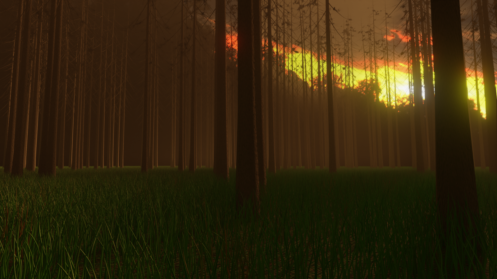

# forest

## 作成
2022/10/01

## Version
- Blender 3.3

## file
- [dikhololo_night](https://polyhaven.com/a/dikhololo_night)
- [Leaf001](https://ambientcg.com/view?id=Leaf001)

## 参考
- [簡単な木の作り方 モデリング編 sapling tree gen【blender 2.83】](https://www.youtube.com/watch?v=-9QcIqXHnkU)
